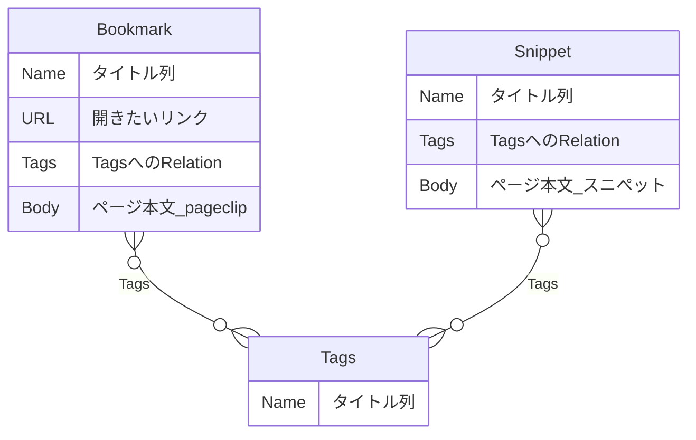

# Raycast Notion Bookmark

Notion のデータベースを、ブックマーク置き場とスニペット置き場として使う Raycast 拡張。

- **Bookmarks**: URL を保存し、タイトル・URL・タグで横断検索して開く。ページ本文にはページの内容（page clip）も残せる。
- **Snippets**: よく使うテキストを保存し、タイトル・本文・タグで横断検索して、そのまま前面のアプリへ貼り付ける。

どちらも複数データベースを対象にできる。タグは Tags データベースへの Relation で表す。

## 必要なもの

- macOS / Raycast
- Notion の個人用アクセストークン
- ブックマーク用・スニペット用のデータベース（どちらか一方だけでもよい）
- （任意）Raycast のブラウザ拡張。Save Bookmark でページ本文を保存するときに使う。

## セットアップ

### 1. データベースを用意する

`URL` 型のプロパティがあるかどうかで、ブックマーク用とスニペット用を区別する。

|                 | ブックマーク用                    | スニペット用       |
| --------------- | --------------------------------- | ------------------ |
| タイトル列      | 必須（列名は任意）                | 必須（列名は任意） |
| `URL` 型の列    | **必須**                          | **作らない**       |
| `Tags` Relation | 任意                              | 任意               |
| ページ本文      | 保存したページの内容（page clip） | スニペット本文     |



- Tags データベースは1つでよい。1行が1タグで、タイトル列は `Name`。Relation の参照先を同じ Tags に揃えると、タグ語彙を共有できる。
- Relation 列の名前は `Tags` 固定。別名だとタグ機能は無効になり、検索とタイトルだけで動く。
- Tech Bookmark と Work Bookmark のように分かれていても、まとめて検索できる。
- スニペット用データベースに `URL` 列を足すと、ブックマーク用として扱われるので注意。

### 2. 個人用アクセストークンを発行する

[Notion の開発者ツール](https://app.notion.com/developers) から発行する。自分の Notion 権限で動くので、Integration へのページ共有は不要。

### 3. Raycast にトークンを設定する

この拡張の Preferences を開き、発行したトークンを貼る。

### 4. 使うデータベースを選ぶ

- Configure Bookmark Databases: ブックマーク用データベースにチェックを入れて保存する。
- Configure Snippet Databases: スニペット用データベースにチェックを入れて保存する。

Search / Save 系のコマンドは、ここで選んだデータベースだけを使う。

## コマンド

### Bookmarks

#### Search Bookmarks

- タイトル、URL、タグを横断検索する。検索バーのドロップダウンでデータベースを絞れる。
- Enter でブックマーク先を開く。Notion のページを開く、URL をコピーするアクションもある。
- Edit Bookmark でタイトル、URL、タグ、本文（page clip）を更新できる。データベースは変えられない。

#### Save Bookmark

- 開いているブラウザタブ、クリップボードの URL、または手入力から保存する。
- 保存先に `Tags` Relation があれば既存タグを選べる。カンマ区切りで新規タグも作れる（Tags データベースにページを作り、ブックマークへ紐づける）。
- ページ本文を保存するか選べる。前回の選択を覚える。保存するときは、Raycast のブラウザ拡張が入っていれば開いているページを markdown にしてページ本文へ入れる。
- 同じ URL が選択中のデータベースにあれば保存済みと出す。同じデータベースへは二重保存しない。
- 保存先が複数あるときは選ぶ。前回の保存先を覚える。

#### Configure Bookmark Databases

- `URL` 型プロパティがあるデータベースだけが一覧に出る。
- 出てこない場合は、トークンがそのデータベースを見られるか、プロパティの型を確認する。

### Snippets

#### Search Snippets

- タイトル、本文、タグを横断検索する。検索バーのドロップダウンでデータベースを絞れる。
- 一覧の右側に本文をプレビューする。
- Enter で Raycast を閉じ、本文を前面のアプリへ貼り付ける。
- Edit Snippet でタイトル、タグ、本文を更新できる。データベースは変えられない。
- 本文はページごとに1リクエストかかるので、`last_edited_time` をキーにキャッシュする。Notion 側で編集すれば次回の検索に反映される。手動で取り直すなら Reload。

#### Save Snippet

- 直前のアプリで選択していたテキスト、なければクリップボードの内容を本文の初期値にする。
- 本文は Notion のページ本文に `plain text` のコードブロックとして入る。markdown 記法もそのまま崩れずに残り、貼り付け時は元のテキストに戻る。
- 本文が空だと保存しない。タイトルを省くと `Untitled` になる。
- 保存先に `Tags` Relation があれば既存タグを選べる。カンマ区切りで新規タグも作れる。
- 保存先が複数あるときは選ぶ。前回の保存先を覚える。

#### Configure Snippet Databases

- `URL` 型プロパティが**ない**データベースだけが一覧に出る。
- 出てこない場合は、トークンがそのデータベースを見られるか、`URL` 列が紛れていないか確認する。

## ローカルで開発する

```bash
npm install
npm run dev
```

Raycast を開くと、開発中の拡張がルート検索に出る。

```bash
npm run lint
npm run typecheck
npm run build
```

### テスト

```bash
npm run test
npm run test:watch
```

- ユニットテストは `tests/` にあり、`src/` と同じ構成で並べる。
- Raycast と Notion API は `tests/support/` のモックへ差し替えるので、実行に Raycast もトークンも要らない。
- コマンドの UI（`*.tsx`）はテスト対象外。判定ロジックは `form.ts` などへ切り出してテストする。

### ディレクトリ構成

```
src/
  lib/          Notion API クライアントとデータソース共通処理
  tags/         Tags Relation の解決とタグ検索キー
  bookmarks/    Search / Save / Configure と page clip の取得・変換
  snippets/     Search / Save / Configure と本文キャッシュ
  *.tsx         package.json の commands に対応するエントリポイント
```
